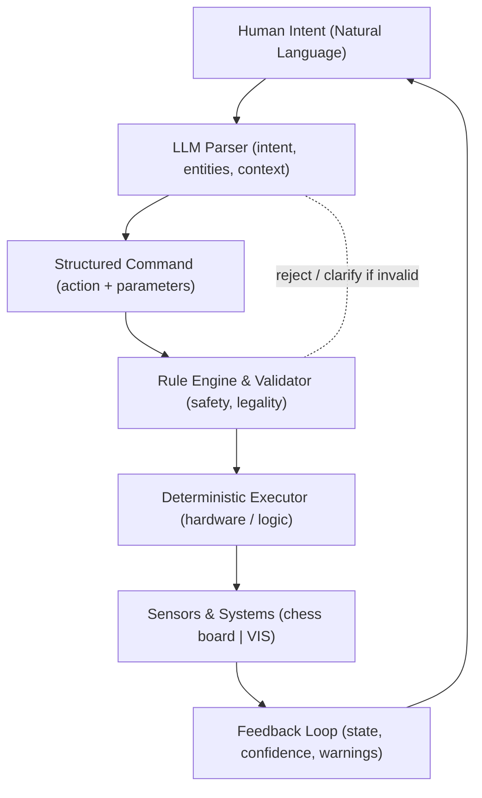

# 🕹️🎮Atari vs 🌌🧠ChatGPT — Medical Implications

**How a 1980s Atari chess engine exposes the limits of LLM reasoning — and what that means for medical AI systems like the Vantage Imaging System (VIS).**

-----

## TL;DR

- Chess is **closed and deterministic**; medicine and imaging are **open and contextual**.
- A tiny Atari chess program wins because it computes *legal states* — GPT-5 guesses *plausible tokens*.
- **Natural Language on top of strict rules** is the optimal architecture:
  - Language = human interface
  - Rules = safety substrate
- For **SaMD** (Software as a Medical Device), this pattern is not optional — it’s how you satisfy both *human usability* and *regulatory traceability*.

-----

## 🎮 Why an Atari Can Beat ChatGPT-5 at Chess

|System                 |Strength                                                                   |Limitation                                      |
|:----------------------|:--------------------------------------------------------------------------|:-----------------------------------------------|
|**Atari chess (1980s)**|Deterministic rule engine, alpha-beta search, fully validated board state  |No creativity, no abstraction                   |
|**GPT-5**              |Natural language mastery, intuitive reasoning about *descriptions* of chess|No formal state model, may suggest illegal moves|


> **Atari wins** because chess is a *closed*, rule-complete universe. GPT-5 reasons in open language space — it speaks the game, but doesn’t *live* it.

-----

## ♟️ Two Ways to “Play” Chess With a Computer

### 1️⃣ Excel-Style Structured Input

- Board encoded as a 64-cell grid.
- Moves validated with formulas: `=CHECK_MOVE("Q", "d1", "h5", Board)`

✅ Perfect precision  
🚫 Requires “speaking spreadsheet.”

### 2️⃣ Natural Language Interface

> “Move my queen to take the knight near the center.”

**Pipeline:**

1. Parse command with LLM → intent + entities
1. Validate against rule engine
1. Execute & log

✅ Natural communication  
🚫 Needs underlying guardrails

**Best of both worlds:** LLM mediates between human intent and deterministic legality.

-----

## 🧩 The Hybrid Pattern: Natural Language on Top of Rules



**Principle:**

- The LLM proposes; the rule engine disposes.
- Language brings flexibility, rules ensure correctness.

-----

## 🧬 Applying This to the Vantage Imaging System (VIS)

### VIS Pipeline Analogy

|Chess Concept       |VIS Equivalent                   |
|:-------------------|:--------------------------------|
|Legal move validator|Exposure / geometry safety limits|
|Board state         |Patient pose + sensor calibration|
|Move execution      |Camera / lighting / motor control|
|Game history        |Imaging log + audit trail        |

### Example Command

“Scan the upper torso again, but soften the right-side lighting and keep ISO under 800.”

|Stage            |Function                                                                               |
|:----------------|:--------------------------------------------------------------------------------------|
|LLM parser       |Detects “scan”, “upper torso”, “lighting right −10%”, “ISO ≤ 800”                      |
|Structured action|`{ "task":"scan", "region":"upper_torso", "lighting":{"right":"-10%"}, "iso_max":800 }`|
|Rule engine      |Checks lux/EV/thermal bounds; clamps values                                            |
|Executor         |Drives gimbals, flashes, sensors deterministically                                     |
|Feedback         |“Adjusted lighting −9%, EV −0.5 EV, ready to capture.”                                 |

✅ Operator ease  
✅ Safety & compliance  
✅ Audit-ready traceability

-----

## ⚖️ SaMD / Medical-Ethics Layer

1. **Separation of Concerns** — LLM never executes, only suggests.
1. **Deterministic Guardrails** — hardware limits, patient distance, lux, duty cycle.
1. **Provenance & Traceability** — every NL command logged with parsed structure + applied rules.
1. **Human-in-the-Loop Gates** — confirmations for any high-risk operation (e.g., flash near eyes).
1. **Bias & Fairness Checks** — ensure capture protocols perform consistently across skin tones and body types.
1. **Verification & Validation** — bench tests comparing predicted vs measured exposure/geometry.
1. **Post-Market Surveillance** — error telemetry, automatic de-identified reporting hooks.

> SaMD compliance requires reproducibility. LLMs provide adaptability only when wrapped in deterministic layers.

-----

## 🧱 Minimal Pseudo-APIs

```typescript
// Natural language → structured intent
type NLCommand = string

type StructuredAction = {
  task: "scan" | "align" | "reconstruct" | "explain" | "calibrate",
  region?: string,
  params?: Record<string, number | string | boolean>,
  constraints?: { iso_max?: number; lux_max?: number; distance_min_cm?: number }
}

// Validation result
type ValidationResult = {
  ok: boolean
  violations: { code: string; detail: string }[]
  boundedAction?: StructuredAction
}
```

-----

## 🧾 Excel vs Natural Language — VIS Comparison

|Mode              |Example                                                            |Characteristics                    |
|:-----------------|:------------------------------------------------------------------|:----------------------------------|
|Structured (Excel)|`=VALIDATE(ISO,Shutter,Aperture,Distance,PatientProfile)`          |Fast, deterministic, unfriendly    |
|Natural Language  |“Re-shoot macro at 100 mm, soften right light 10%, keep ISO ≤ 800.”|Intuitive, needs parser + validator|

-----

## 🧱 Architecture Notes: NL on Top of Rules

**Pattern:**

1. NL intake → LLM parses → typed schema.
1. Rule engine clamps / rejects → safe command.
1. Executor performs deterministic operation.
1. Feedback closes loop.

**VIS specifics:**

- Exposure, geometry, and motion limits hard-coded.
- Calibrations stored per device.
- Every frame reproducible from logs.

**Anti-patterns:**

- Letting an LLM drive actuators directly.
- Hidden state changes or unlogged prompts.
- Non-deterministic capture pipelines.

-----

## 🧮 Why This Matters

- Closed systems (chess, safety-critical imaging) → rules dominate.
- Open systems (conversation, triage) → language dominates.
- Hybrid systems (SaMD) → language on top of rules is the only viable path.

> Natural language enables intelligence; rules enable trust.

-----

## 📄 License

MIT License © 2025 chasesdev

-----

## 📚 Credits

Developed from discussions on hybrid architectures for Vantage Imaging System and parallels between symbolic computation and probabilistic reasoning.

Inspired by Atari-era chess engines, Excel determinism, and FDA-grade AI design.